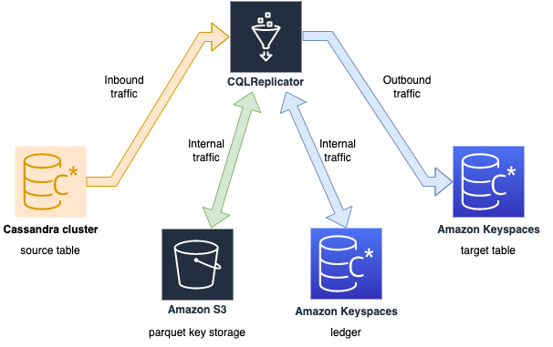
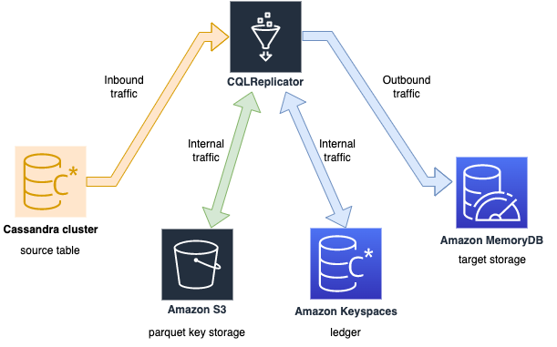
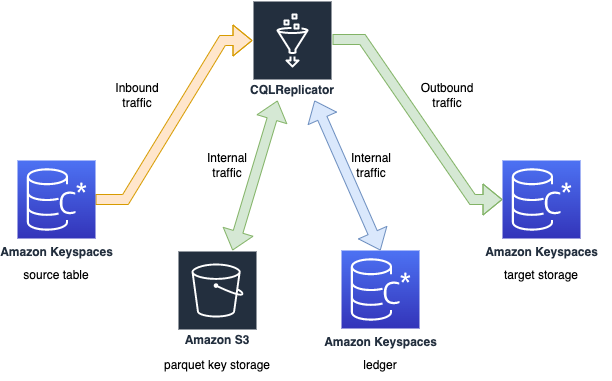
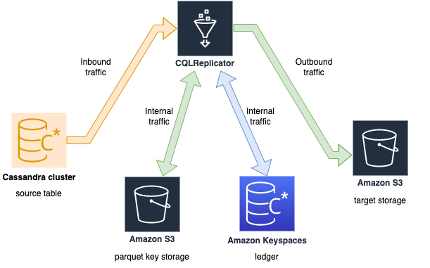
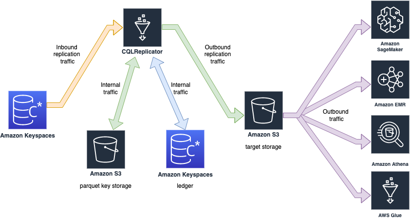
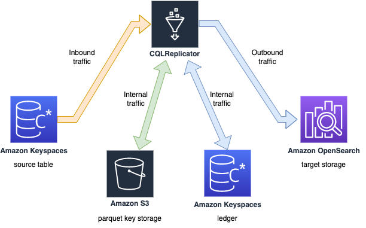

## NoSQL migration guide for purpose built databases with CQLReplicator

Welcome to the NoSQL migration guide. This guide is designed to assist you in migration your data from Cassandra to
purpose-built NoSQL databases on AWS using CQLReplicator.

The guide covers multiple migration use cases, providing detailed instructions and examples to help you understand
the process. Whether you're moving data from Cassandra to Amazon Keyspaces, S3, or Amazon MemoryDB for Redis.

In addition to migration use cases, the guide explores how you can leverage your data for Data Analytics/ML and
incremental
backup. Lear how to extract insights from Amazon Keyspaces, optimize your storage, and make data-driven decisions.

### Near zero downtime migration to Amazon Keyspaces

The objective of this use-case is to support customers in seamlessly migrating from self-managed Cassandra clusters to
Amazon Keyspaces.
This migration approach ensures zero downtime, no code compilation, predictable incremental traffic, and migration
costs.

#### Step 1: Identify Migration Workload

Identify the keyspaces and tables in your Cassandra cluster that you want to migrate. You can use the `DESCRIBE` command
in `CQLSH` to list all keyspaces and tables.

#### Step 2: Check Functional Compatibility

Amazon Keyspaces is compatible with CQL 3.11 API(backward-compatibility with version 2.x). Check
with [supported Cassandra APIs, operations, functions, and data types in Amazon Keyspaces](https://docs.aws.amazon.com/keyspaces/latest/devguide/cassandra-apis.html).

#### Step 3: Check Cassandra Cluster Capacity

Ensure that you have enough capacity/resources (CPUs, memory, network throughput, and storage) on the Cassandra cluster
to handle
migration workload.

#### Step 4: Estimate Migration Costs

Estimate the number of rows per table in your Cassandra cluster. This will help you estimate the migration costs for
AWS Glue (which be used for CQLReplicator) and Amazon Keyspaces (which will store the migrated data).

#### Step 5: Prepare Target Environment

Deploy Amazon Keyspaces tables that correspond to your Cassandra tables. Remember to pr-warm or provision these tables
to ensure
optimal performance.

#### Step 6: Run CQLReplicator

Follow the instructions provided in the [CQLReplicator documentation](glue/README.MD) to configure, initialize, and run
the migration tool.

### Near zero downtime migration to Amazon MemoryDB

The objective of this use-case is to support customers in seamlessly migrating from self-managed Cassandra clusters to
Amazon MemoryDB.
This migration approach ensures zero downtime, no code compilation, predictable incremental traffic, and migration
costs.

#### Step 1: Identify Migration Workload

Identify the keyspaces and tables in your Cassandra cluster that you want to migrate. You can use the `DESCRIBE` command
in `CQLSH` to list all keyspaces and tables.

#### Step 2: Check with target structure on MemoryDB

CQLReplicator performs two keys transformations:
**Primary Key Conversion**: CQLReplicator converts the primary key from Cassandra into a string format for MemoryDB,
e.g.
a primary key composed of multiple partition and clustering keys would be transformed into a single `key1#key2#key3` in
MemoryDB.
**Regular columns as JSON**: Regular columns from Cassandra are stored as JSON text in MemoryDB. This allows for
flexible and efficient
data access in MemoryDB, as JSON is widely used data interchange format.

#### Step 3: Check Cassandra Cluster Capacity

Ensure that you have enough capacity/resources (CPUs, memory, network throughput, and storage) on the Cassandra cluster
to handle
migration workload.

#### Step 4: Estimate Migration Costs

Estimate the number of rows per table in your Cassandra cluster. This will help you estimate the migration costs for
AWS Glue (which be used for CQLReplicator) and traffic against Amazon MemoryDB (which will store the migrated data).

#### Step 5: Prepare Target Environment

[Deploy Amazon MemoryDB cluster](https://docs.aws.amazon.com/memorydb/latest/devguide/set-up.html) that correspond to
your Cassandra tables.

#### Step 6: Run CQLReplicator

Follow the instructions provided in the [CQLReplicator documentation](glue/README.MD) to configure, initialize, and run
the migration tool.

### Use-case for materialized views with Amazon Keyspaces

Materialized view (MV) is a powerful concept to manage and access your data. MV allows you to create a new table
(the materialized view) that is differently partitioned. This allows you to create MVs that are optimized for
your specific access pattern.

It's important to remember to provision enough Read Capacity Units (RCUs) on the source table. This ensures that
your source table can handle the additional read workload from CQLReplicator without impacting of your other
applications.

The main change you need to do is to replace a content of `conf/CassandraConnector.conf`
by `conf/KeyspacesConnector.conf`.
So, that `conf/CassandraConnector.conf` points CQLReplicator to Amazon Keyspaces instead of Cassandra cluster.

Follow the instructions provided in the [CQLReplicator documentation](glue/README.MD) to configure, initialize, and run
your replication process between the source table (base table) and the target table (MV).

By using MV concept and CQLReplicator, you can create efficient, scalable, and flexible data access patterns with
Amazon Keyspaces.

### Use-case for incremental backup with Amazon Keyspaces

Incremental backups are another way to back up your Amazon Keyspaces data on Amazon S3. With incremental backups every
2 minutes, only the data has changed since your last backup is persisted.

CQLReplicator can be used to facilitate this process. You can point CQLReplicator to a source table in Amazon Keyspaces
and a target Amazon S3 bucket. CQLReplicator flushes parquet files by 32MB into the Amazon S3 bucket.

The structure of the S3 prefix is as follows: `bucket-name/[tile]/[operation]/[timestamp]/*.parquet`.
The tile is the current CQLReplicator number that handles an operation, from 0 to N tiles, the operations include
`INSERT`, `UPDATE`, and `DELETE`, the timestamp is a local timestamp in following format `yyyy-mm-dd hh:mm:ss`.

### Use-case for Analytics/ML with Amazon Keyspaces

The incremental backup feature in CQLReplicator, facilitated by AWS Glue, not only ensures incremental data backup but
also opens up opportunities for advanced analytics and machine learning (ML).

The parquet files, stored in Amazon S3 as part of the backup process, can be directly used by various AWS services for
analytics and ML purposes:

1. **Amazon SageMaker**: You can use the Parquet files in Amazon SageMaker to train ML models. SageMaker provides a
   complete
   set of tools for every set of the ML workflow.
2. **Amazon EMR**: Amazon EMR can process large amount of data stored in Parquet files. You can run big data frameworks
   such as Apache Spark and Hadoop on EMR to analyze your data.
3. **Amazon Athena**: Amazon Athena allows you to query data directly from S3 using standard SQL. You can use Athena to
   run ad-hoc queries on Parquet files.
4. **AWS Glue**: AWS Glue can catalog your Parquet files in S3 and make them available for ETL jobs. You can transform
   your data and make it available for a wide range of analytics and ML services.

By leveraging these services, you can extract valuable insights from your data, build predictive models, and make
data-driven decisions.

### License

### Use-case for Search with Amazon Keyspaces (Preview)

CQLReplicator is a tool to replicate payloads (INSERTS, UPDATES) from Amazon Keyspaces to Amazon OpenSearch Service.

#### Step 1: Identify Migration Workload

Identify the keyspaces and tables in your source that you want to replicate to Amazon OpenSearch Service.
You can use the `DESCRIBE` command in `CQLSH` to list all keyspaces and tables.

#### Step 2: Check target index structure on Amazon OpenSearch Service

Create a search index `target_keyspace_name-target_table_name` Amazon OpenSearch Service (optional). if the search index
doesn't exist
CQLReplicator will create a simple schema that maps all your columns to search fields. All fields will be `text`.

#### Step 3: Check Amazon Keyspaces table Capacity

Ensure that you have enough RCUs (read capacity units) on the Keyspaces table to handle replication traffic.

#### Step 4: Estimate Replication Costs

Estimate the number of rows in your source table. This will help you estimate the replication costs for
AWS Glue (which be used for CQLReplicator) and traffic against Amazon OpenSearch service.

#### Step 5: Prepare Target Environment

[Deploy Amazon OpenSearch Service](https://docs.aws.amazon.com/opensearch-service/latest/developerguide/gsg.html) that
correspond to
your Amazon Keyspaces tables.

#### Step 6: Run CQLReplicator

Follow the instructions provided in the [CQLReplicator documentation](glue/README.MD) to configure, initialize, and run
the migration tool.

#### Step 7: Validate the result

if you want quickly validate the replicated workload with SQL
use [opensearchsql](https://github.com/opensearch-project/sql)

This tool licensed under the Apache-2 License. See the LICENSE file.