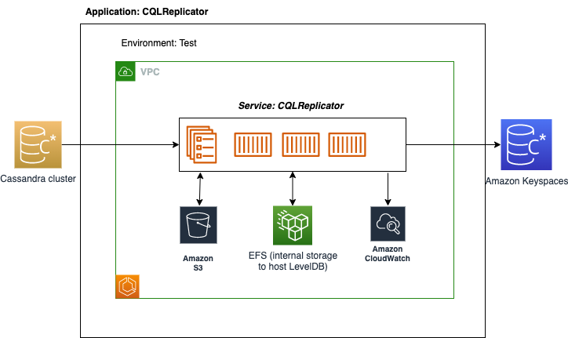

## CQLReplicator

The aim of this project is to assist customers is seamlessly migrating from self-managed Cassandra to Amazon Keyspaces,
ensuring zero downtime. This means that customers can replicate their existing Cassandra workload in to Amazon
Keyspaces,
without needing to make any changes to their client-side code or using proxies.

### Architecture

Customers have the flexibility to scale the migration workload by deploying multiple instances of CQLReplicator. Each
instance
of CQLReplicator is a java process responsible for handling specific token range (tile). In the event of a CQLReplicator
failure,
customers can simply restart the migration process from the point where it was interrupted by restarting the failed
CQLReplicator instances.



### Prerequisites

List any prerequisites needed to run CQLReplicator, such as:

- AWS account
- Docker
- ECS Copilot CLI
- Gradle 7.4.2

### Getting Started

Set up and deploy CQLReplicator
using [AWS ECS Copilot](https://aws.github.io/copilot-cli/docs/getting-started/install/). Include the following steps:

### Configuration

1. Clone the repository:

   ```bash
   git clone https://github.com/aws-samples/cql-replicator
   ```

2. Navigate into the project directory:
   ```bash
   cd cql-replicator
   ```
   Create a S3 bucket `cqlreplicator`. The bucket stores the artifacts:
   `config.properties`, `KeyspacesConnector.conf`, and `CassandraConnector.conf`
   e.g, `s3:/bucketname/keyspace_name/table_name`

   ```bash
   export CQLR_BUCKET_NAME=cqlreplicator #S3 Bucket to store the artifacts
   export CQLR_KS_NAME=ks_test_cql_replicator #S3 prefix for the keyspace name
   export CQLR_TBL_NAME=test_cql_replicator #S3 prefix for the table name
   ```

3. Build CQLReplicator:
   ```bash
   gradle build
   gradle task deploy
   ```

4. Initialize the ECS Copilot environment:
   Configure the required resources, such as VPC, S3 buckets etc., using the prompts provided by the `copilot init`
   command.

   ```bash
   copilot app init cql-replicator
   ```

5. Configure CQLReplicator:
    * Configure the source and target tables in `config.properties`
    * Configure migrated columns in `config.properties`
    * Configure write time of regular columns to detect updates in the source table in `config.properties`
    * Configure connectivity to the source Cassandra cluster `CassandraConnector.conf`
    * Configure connectivity to the target Keyspaces table `KeyspacesConnector.conf`
    * Copy all artifacts to s3://your-bucket-name/keyspacename/tablename

6. Deploy the CQLReplicator cluster:
   Initiate and deploy the service, and the test environment,

   ```bash
   copilot svc init --name cql-replicator-service
   ```
   ```bash
   copilot env init --name test
   ```
   ```bash
   copilot env deploy --name test
   ```
   ```bash
   copilot svc deploy --name cql-replicator-service --env test
   ```

### Usage

CQLReplicator will immediately start replicating the Cassandra workload when all ECS tasks are running.
Before restarting or updating the ECS tasks delete `tiles` with the locking files
from `s3://bucket/keyspace_name/table_name`.

#### Define the number of tiles

One CQLReplicator can handle up to 1M primary keys, if you want to handle over 1M please scale up ECS tasks.

You can avoid high ECS costs by replicating the historical workload with AWS Glue and after
enable `ENABLE_REPLICATION_POINT` to handle only new workload after specific timestamp.

#### Restarting the ECS cluster

After restarting the ECS cluster, the CQLReplicator instances will start replicating
from a scratch. To void losing previously replicated workload you might use two workarounds:

* Use Amazon EFS instead of ephemeral storage in `manifest.yml` e.g,
   ```yaml
   storage:
     volumes:
       myManagedEFSVolume:
        efs: true
        path: /var/efs
        read_only: false
   ```
  and set `LOCAL_STORAGE_PATH` to `/var/efs` in `config.properties`
* Set `ENABLE_REPLICATION_POINT` to `true` and `STARTING_REPLICATION_TIMESTAMP` to the most recent timestamp
  in `config.properties`.

#### Avoid the high CPU utilization of the Cassandra cluster

CQLReplicator might add a CPU overhead due to pooling data periodically.If the CPU utilization is over
70% you can increase `POOLING_PERIOD` from 1 second to a higher value and scale down
the CQLReplicator instances by reducing `REPLICATE_WITH_CORE_POOL_SIZE` and
`REPLICATE_WITH_MAX_CORE_POOL_SIZE` and decrease the number of CPUs per ECS task.
Finally, you might deploy another Cassandra DC to shift your migration workload to it.

### Limitations

CQLReplicator doesn't support replication of counters

### Cleanup

Delete the CQLReplicator ECS cluster:

   ```bash
   copilot svc delete --name cql-replicator-service  
   copilot app delete --name cql-replicator
   ```

### Run one CQLReplicator instance locally (only for testing purposes)

  ```bash
  java -XX:+UseShenandoahGC --add-opens=java.base/jdk.internal.ref=ALL-UNNAMED \
       -Dlogback.configurationFile=/path-to-logback/logback.xml \
       -cp CQLReplicator-1.0-SNAPSHOT.jar com.amazon.aws.cqlreplicator.Starter --tile 0 --tiles 1 \
       --pathToConfig /path-to-conf/conf
  ```

### License

This tool licensed under the Apache-2 License. See the LICENSE file.