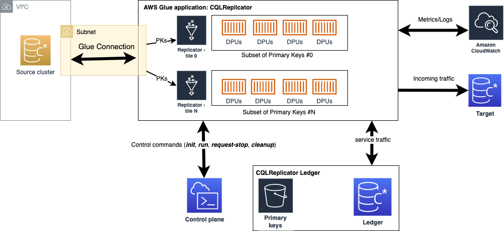

# CQLReplicator with AWS Glue
The objective of this project is to support customers in seamlessly migrating from self-managed Cassandra clusters to Amazon Keyspaces.
This migration approach ensures near zero downtime, no code compilation, predictable incremental traffic, and reduced migration costs.

## Architecture
This solution offers customers the flexibility to scale the migration workload up and out by deploying multiple Glue
jobs of CQLReplicator.
Each glue job (tile) is tasked with handling a specific subset of primary keys to distribute migration 
workload evenly across data processing units. A single Glue worker (G.025X) can write up to 400 WCUs per second 
against the target table in Amazon Keyspaces. This allows for easy estimation of the final traffic against Amazon Keyspaces.



## Prerequisites
List of prerequisites needed to run CQLReplicator with AWS Glue, such as:

- AWS account
- [AWS CloudShell](https://aws.amazon.com/cloudshell/)
- [AWS Glue](https://aws.amazon.com/glue/)
- [Amazon Keyspaces](https://aws.amazon.com/keyspaces/) (keyspace and tables)
- [Cassandra cluster](https://docs.aws.amazon.com/prescriptive-guidance/latest/patterns/deploy-a-cassandra-cluster-on-amazon-ec2-with-private-static-ips-to-avoid-rebalancing.html)
- [Reference](https://docs.datastax.com/en/developer/java-driver/4.3/manual/core/configuration/reference/) configuration files for Amazon Keyspaces and Cassandra Cluster

## Getting Started
Download the project to your home folder by executing the following command:
```bash
git clone https://github.com/aws-samples/cql-replicator.git
```

To set up AWS Glue for communication with your Cassandra cluster in Amazon VPC, you need to configure proper access settings. 
This involves creating a security group with a self-referencing inbound rule that allows all TCP ports.
This self-referencing rule restricts the source to the same security group within the VPC, enhancing security by not opening it to all networks.
It's worth noting that your VPC's default security group may already include such a self-referencing inbound rule for all traffic.
By implementing these configurations, you ensure that AWS Glue components can communicate effectively while maintaining a secure network environment.

## Primary Migration Path
Direct migration to Amazon Keyspaces, offering a fully managed, serverless Cassandra-compatible experience: 
- [Apache Cassandra to Amazon Keyspaces](docs/keyspaces/README.MD)

## Complementary Solutions 
Additional connectors for specific use cases including data lakes (S3), search capabilities (OpenSearch), and in-memory performance (MemoryDB):
- [Apache Cassandra to Amazon S3](docs/s3/README.MD)
- [Apache Cassandra to Amazon Opensearch](docs/oss/README.MD)
- [Apache Cassandra to Amazon MemoryDB](docs/memorydb/README.MD)

## License
This tool licensed under the Apache-2 License. See the LICENSE file.