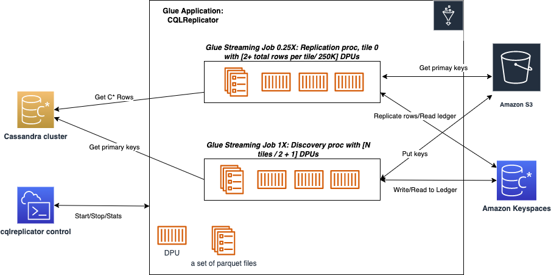
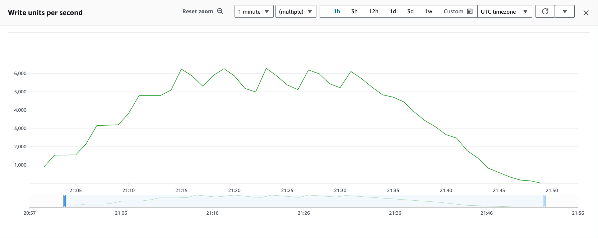

# CQLReplicator with AWS Glue
The objective of this project is to support customers in seamlessly migrating from self-managed Cassandra clusters to Amazon Keyspaces.
This migration approach ensures zero downtime, no code compilation, predictable incremental traffic, and reduced migration costs.

## Architecture
This solution offers customers the flexibility to scale the migration workload up and out by deploying multiple Glue
jobs of CQLReplicator.
Each glue job (tile) is tasked with handling a specific subset of primary keys (250K per one data processing unit
G.025X) to distribute migration
workload evenly across data processing units.
A single replication glue job (AWS Glue DPU - 0.25X) can push up to 1500 WCUs per second against the target table in
Amazon Keyspaces. This allows for easy estimation of the final traffic against Amazon Keyspaces.



## Prerequisites
List of prerequisites needed to run CQLReplicator with AWS Glue, such as:

- AWS account
- [AWS CloudShell](https://aws.amazon.com/cloudshell/)
- [AWS Glue](https://aws.amazon.com/glue/)
- [Amazon Keyspaces](https://aws.amazon.com/keyspaces/) (keyspace and tables)
- [Cassandra cluster](https://docs.aws.amazon.com/prescriptive-guidance/latest/patterns/deploy-a-cassandra-cluster-on-amazon-ec2-with-private-static-ips-to-avoid-rebalancing.html)
- [Reference](https://docs.datastax.com/en/developer/java-driver/4.3/manual/core/configuration/reference/) configuration 
files for Amazon Keyspaces and Cassandra Cluster

## Getting Started
To enable AWS Glue components to communicate, you must set up access to your Cassandra cluster in Amazon VPC.
To enable AWS Glue to communicate between its components, specify a security group with a self-referencing inbound rule
for all TCP ports. By creating a self-referencing rule, you can restrict the source to the same security group in the VPC,
and it's not open to all networks. The default security group for your VPC might already have a self-referencing inbound rule
for ALL Traffic.

1. Download the project to your home folder by executing the following command:
    ```shell
    git clone https://github.com/aws-samples/cql-replicator.git
    ```
2. Modify reference configuration files `../glue/conf/CassandraConnector.conf` and `../glue/conf/KeyspacesConnector.conf` in ../conf accordingly to the environment
3. ```cd cql-replicator/glue/bin```

## Init migration process
The following command initializes the CQLReplicator environment, which involves the copying JAR artifacts, creation a Glue connector, 
a S3 bucket, a Glue job, migration keyspace, and ledger table. 

```shell
    cqlreplicator --state init --sg '"sg-1","sg-2"' \ 
                  --subnet "subnet-XXXXXXXXXXXX" --az us-west-2a --region us-west-2 \ 
                  --glue-iam-role glue-cassandra-migration --landing-zone s3://cql-replicator-1234567890-us-west-2
```

- `--sg` - these security group(s) which allow access to the Cassandra cluster from AWS Glue and includes the
  self-referencing inbound rule for all traffic
- `--subnet` - this is the subnet to which the Cassandra cluster belongs. In AWS Glue, when a Glue job needs to run in
  your Virtual Private Cloud (VPC),
  AWS Glue sets up elastic network interfaces that enable your Glue jobs to connect securely to other resource within
  your VPC. Each elastic network interface
  is assigned a private IP address from the IP address range within the subnet you specified. For example, 20 workers
  need 20 IP addresses.
- `--az` - this is the AZ of the subnet
- `--region` - AWS region where the Cassandra cluster is deployed
- `--glue-iam-role` - you
  need [the IAM role permissions](https://docs.aws.amazon.com/glue/latest/dg/create-an-iam-role.html)
  that AWS Glue can assume when calling other services on your behalf. Services: Amazon Keyspaces and S3
- `--landing-zone` - this is an optional parameter, you can reuse any existing S3 buckets in the AWS account
  If you don't supply it, init process will try to create a new bucket to store config, JAR artifacts, and intermediate
  files
- `--target-type` - this is an optional parameter, the default value is `keyspaces`, available options: `parquet`
  , `memorydb`, `opensearch` (preview)
- `--skip-glue-connector` - this is an optional parameter allows you to skip the glue connector creation step
- `--skip-keyspaces-ledger` - in case if you don't want to create/delete the ledger (the internal table in Amazon
  Keyspaces migration.ledger) 

```shell
    cqlreplicator --state init --region us-west-2 \ 
                  --skip-glue-connector \
                  --glue-iam-role glue-cassandra-migration \
                  --landing-zone s3://cql-replicator-1234567890-us-west-2 \
                  --target-type parquet
```

After running the below command, you should find in the AWS account:

1. CQLReplicator Glue job and Glue connector in AWS Glue
2. Amazon S3 bucket that stores the artifacts
3. Keyspace `migration` and `ledger` table in Amazon Keyspaces

## Start migration process

To operate CQLReplicator on AWS Glue, you need to use `--state run` command, followed by a series of parameters. The
precise configuration of these is primarily determined by your unique migration requirements. For instance, these
settings may
vary if you choose to replicate TTLs, updates, or offloading objects exceeding 1MB to Amazon S3.

Estimate the number of tiles, each tile (concurrent glue job) can handle up to 74M primary keys with 299 DPUs (G.025X)
maximum,
for example, 8 tiles can handle up to 598M primary keys.

Let's run the following command to replicate the workload from the Cassandra cluster to Amazon Keyspaces:

```shell
   cqlreplicator --state run --tiles 8 --landing-zone s3://cql-replicator-1234567890-us-west-2 --region us-west-2 \
                 --src-keyspace ks_test_cql_replicator --src-table test_cql_replicator \ 
                 --trg-keyspace ks_test_cql_replicator --trg-table test_cql_replicator --inc-traffic
```

Your source keyspace and table `ks_test_cql_replicator.test_cql_replicator` in the Cassandra cluster.
Your target keyspace and table `ks_test_cql_replicator.test_cql_replicator` in Amazon Keyspaces.
Parameter `--inc-traffic` - enables incremental traffic to not overload the Cassandra Cluster and Amazon Keyspaces
with high number of requests. CQLReplicator is going to increase traffic every 4 minutes. In the following
example with 8 tiles and one cassandra row is under 2KB, the traffic is going to be gradually increased every 4
minutes. At peak traffic, it can reach up to 6,300 WCUs per second.



### Replicate near-real time updates, inserts, and deletes
```shell
   cqlreplicator --state run --tiles 8 --landing-zone s3://cql-replicator-1234567890-us-west-2 --region us-west-2 \
                 --writetime-column col3 --src-keyspace ks_test_cql_replicator --src-table test_cql_replicator \ 
                 --trg-keyspace ks_test_cql_replicator --trg-table test_cql_replicator --inc-traffic
```

### Replicate with TTL
the TTL feature should be [enabled](https://docs.aws.amazon.com/keyspaces/latest/devguide/TTL-how-it-works.html#ttl-howitworks_enabling) 
on the target table before running the following command
```shell
   cqlreplicator --state run --tiles 8 --landing-zone s3://cql-replicator-1234567890-us-west-2 --region us-west-2 \
                 --writetime-column col3 --src-keyspace ks_test_cql_replicator --src-table test_cql_replicator --ttl-column col3 \ 
                 --trg-keyspace ks_test_cql_replicator --trg-table test_cql_replicator --inc-traffic
```

### Offload large objects

Before running the migration process
configure [lifecycle](https://docs.aws.amazon.com/AmazonS3/latest/userguide/intro-lifecycle-rules.html)
for the S3 bucket to delete objects after expiration. The xref column should be present in the source and the target
tables before running the cqlreplicator.

The payload will be compressed by [LZ4](https://fuchsia.googlesource.com/third_party/lz4/+/refs/tags/v1.7.5/README.md) and stored in the S3 bucket. The compressed payload includes the length of the original 
decompressed data, so that you don't need to save the length at anywhere else. The compressed data must be decompressed by 
LZ4DecompressorWithLength and is NOT compatible with any other decompressors in lz4-java or any other lz4 tools. 
This class deliberately does not extend LZ4Compressor because they are not interchangeable.

```shell
./cqlreplicator --state run --tiles 8 --landing-zone s3://cql-replicator-1234567890-us-west-2 --src-keyspace ks_test_cql_replicator \
                --src-table test_cql_replicator --trg-keyspace ks_test_cql_replicator --trg-table test_cql_replicator \
                --region us-west-2 --ttl-column col3 --json-mapping '
                {
                 "replication": {
                   "allColumns": true,
                   "columns":[""],
                   "useCustomSerializer": false,
                   "useMaterializedView": {
                     "enabled": false,
                     "mvName": "mvName"
                  }
                },
                 "keyspaces": {
                   "compressionConfig": {
                   "enabled": false,
                   "compressAllNonPrimaryColumns": false,
                   "compressNonPrimaryColumns": [""],
                   "targetNameColumn": ""
                 },
                 "largeObjectsConfig": {
                   "enabled": true,
                   "column": "col1",
                   "bucket": "my-application-resource",
                   "prefix": "ks_test_cql_replicator/test_cql_replicator/col1",
                   "enableRefByTimeUUID": false,
                   "xref": "link"
                 }
                }}'
```
If you enable `enableRefByTimeUUID` the S3 bucket will be populated in the following format s3://my-application-resource/ks_test_cql_replicator/test_cql_replicator/col1/<timeUUID>.
The target column link will be populated by a referencing timeUUID, and col1 will be skipped.

If you disable `enableRefByTimeUUID` the S3 bucket will be populated in the following format s3://my-application-resource/ks_test_cql_replicator/test_cql_replicator/col1/key=<col0>:<key>/payload,
where col0 is the clustering column, and key is the partition key. The target column link and col1 will be skipped.

### Replay failed operations (inserts, updates, and deletes)

`--replay-log` - this option allows you to replay failed operations during the replication phase, use cases:
1) you have large partitions (over tens of megabytes) in the source,
2) you expect the high number of retries against the target (over 256 retries).

The logs will be stored in your landing S3 bucket, e.g. s3://cql-replicator-1234567890-us-west-2/ks-name/tbl-name/dlq,
the file format is `log-epoch.msg`.

## Stop migration process

To stop migration process gracefully run the following command for all tiles:

```shell
   cqlreplicator --state request-stop --landing-zone s3://cql-replicator-1234567890-us-west-2 --region us-west-2 \
                 --src-keyspace ks_test_cql_replicator --src-table test_cql_replicator
```

To stop migration process gracefully run the following command for a single tile:

```shell
   cqlreplicator --state request-single-stop --tile 1 --landing-zone s3://cql-replicator-1234567890-us-west-2 --region us-west-2 \
                 --src-keyspace ks_test_cql_replicator --src-table test_cql_replicator
```

To start migration process for a single tile:

```shell
   cqlreplicator --state run-single -tile 1 --tiles 8 --landing-zone s3://cql-replicator-1234567890-us-west-2 --region us-west-2 \
                 --src-keyspace ks_test_cql_replicator --src-table test_cql_replicator \ 
                 --trg-keyspace ks_test_cql_replicator --trg-table test_cql_replicator --inc-traffic
```

## Recover from failures

Customers can simply restart the migration process from the point where it was interrupted by restarting the failed
CQLReplicators jobs. To restart the failed CQLReplicators jobs, you need to rerun your `run` command with the same
parameters
if both the discovery and some of the replicators have failed. If the discovery job is still running and some of the
replicators have failed, you need to use extra flag `--skip-discovery`.

## Cleanup the ledger

If you wish to reset the CQLReplicator for a specific table, add the `--cleanup-requested` flag to your `run` command.
This action will clean up both the internal CQLReplicator ledger table and the S3 data, but don't forget to remove it
if you want to stop it and run it again.

## Get migration stats

To obtain the number of replicated rows during the back filling phase, run the following command:

```shell
   cqlreplicator --state stats --landing-zone s3://cql-replicator-1234567890-us-west-2 \ 
                 --src-keyspace ks_test_cql_replicator --src-table test_cql_replicator \
                 --region us-west-2
```

To obtain the number of replicated rows after the back filling phase, run the following command:

```shell
cqlreplicator --state stats --landing-zone s3://cql-replicator-1234567890-us-west-2 \
              --src-keyspace ks_test_cql_replicator --src-table test_cql_replicator \
              --region us-west-2 --replication-stats-enabled
```

```
    ___ ___  _     ____            _ _           _
  / ___/ _ \| |   |  _ \ ___ _ __ | (_) ___ __ _| |_ ___  _ __
 | |  | | | | |   | |_) / _ \ '_ \| | |/ __/ _` | __/ _ \| '__|
 | |__| |_| | |___|  _ <  __/ |_) | | | (_| (_| | || (_) | |
  \____\__\_\_____|_| \_\___| .__/|_|_|\___\__,_|\__\___/|_|
                            |_|
·······································································
:     __          _______   _____           _____                     :
:    /\ \        / / ____| |  __ \         / ____|                    :
:   /  \ \  /\  / / (___   | |__) | __ ___| (___   ___ _ ____   _____ :
:  / /\ \ \/  \/ / \___ \  |  ___/ '__/ _ \\___ \ / _ \ '__\ \ / / _ \:
: / ____ \  /\  /  ____) | | |   | | | (_) |___) |  __/ |   \ V /  __/:
:/_/    \_\/  \/  |_____/  |_|   |_|  \___/_____/ \___|_|    \_/ \___|:
·······································································
[2024-02-02T16:50:18-05:00] OS: Linux
+------------------------------------------------------------------------+
| Tile     | Inserts  | Updates  | Deletes  | Timestamp                  |
+------------------------------------------------------------------------+
| 0        | 4        | 1        | 0        | "2024-02-02T21:50:12.888"  |
+------------------------------------------------------------------------+
| 1        | 2        | 2        | 1        | "2024-02-02T21:50:25.454"  |
+------------------------------------------------------------------------+
[2024-02-02T16:50:39-05:00] Discovered rows in ks_test_cql_replicator.test_cql_replicator is 70270
[2024-02-02T16:50:39-05:00] Replicated rows in ks_test_cql_replicator.test_cql_replicator is 70270
```

## AWS Glue Monitoring

You can profile and monitor CQLReplicator operations using AWS Glue job profiler. It collects and processes raw data
from AWS Glue jobs into readable, near real-time metrics stored in Amazon CloudWatch.
These statistics are retained and aggregated in CloudWatch so that you can access historical information for a better
perspective on how your application is performing.

In order tp enable the CQLReplicator enhanced monitoring use the `--enhanced-monitoring-enabled` flag with your init
command.

***You may incur additional charges when you enable job metrics and CloudWatch custom metrics are created***

## Cost optimization

In order to reduce AWS Glue costs after the historical workload moved to the target storage:

1. Stop the migration
   process: `cqlreplicator --state request-stop --landing-zone s3://cql-replicator-1234567890-us-west-2 --region us-west-2 \
   --src-keyspace ks_test_cql_replicator --src-table test_cql_replicator`
2. Restart the migration process with the same number of tiles but lower number of
   DPUs: `cqlreplicator --state run --tiles 8 --landing-zone s3://cql-replicator-1234567890-us-west-2 --region us-west-2 \
   --src-keyspace ks_test_cql_replicator --src-table test_cql_replicator \
   --trg-keyspace ks_test_cql_replicator --trg-table test_cql_replicator --override-rows-per-worker 500000`

## Point in time replication

if you want to replicate your data from a timestamp simply add the flag `--start-replication-from` followed by
the timestamp to your command line:

```shell
   cqlreplicator --state request-stop --tiles 8 --landing-zone s3://cql-replicator-1234567890-us-west-2  \
                 --writetime-column col1 --region us-west-2 \
                 --src-keyspace ks_test_cql_replicator --src-table test_cql_replicator \
                 --trg-keyspace ks_test_cql_replicator --trg-table test_cql_replicator \
                 --start-replication-from 1706408365278858
```

## Compress selected columns

To minimize the size of large columns in the target table, enable the `compressionConfig` in the json mapping.
All selected columns will be encoded in JSON format and compressed by the LZ4 fast compressor.

Note that the compressed payload includes the length of the original decompressed data, so that you don't need to save 
the length at anywhere else. The compressed data must be decompressed by [LZ4DecompressorWithLength](https://javadoc.io/doc/org.lz4/lz4-java/latest/net/jpountz/lz4/LZ4DecompressorWithLength.html) 
and is NOT compatible with any other decompressors in lz4-java or any other lz4 tools. This class deliberately does not extend 
LZ4Compressor because they are not interchangeable.

```shell
./cqlreplicator --state run --tiles 4 --landing-zone "s3://cql-replicator-1234567890-us-east-1-dev" --writetime-column col2 \
                                      --region us-east-1 --src-keyspace ks_test_cql_replicator --src-table test_cql_replicator \ 
                                      --trg-keyspace ks_test_cql_replicator --trg-table test_cql_replicator_compressed_columns \
                                      --json-mapping '{
                                          "replication": {
                                            "allColumns": true,
                                            "columns":[],
                                            "useCustomSerializer": false
                                          },
                                          "keyspaces": {
                                          "compressionConfig": {
                                            "enabled": true,
                                            "compressAllNonPrimaryColumns": false,
                                            "compressNonPrimaryColumns": ["col2","col3","col4","col5","col6","col7","col8"],
                                            "targetNameColumn": "compressedPayload"
                                          }}
                                        }'
```

## Replicate only selected columns

if you want to change the replicated columns set `allColumns`:`false`, and set the columns
list `columns`:`["col1","col2"]`
in the json mapping during the `run`, for example,

```shell
./cqlreplicator --state run --tiles 4 --landing-zone "s3://cql-replicator-1234567890-us-east-1-dev" --writetime-column col2 \
                                      --region us-east-1 --src-keyspace ks_test_cql_replicator --src-table test_cql_replicator \ 
                                      --trg-keyspace ks_test_cql_replicator --trg-table test_cql_replicator_compressed_columns \
                                      --json-mapping '{
                                          "replication": {
                                            "allColumns": false,
                                            "columns":["col1", "col2"],
                                            "useCustomSerializer": false
                                          },
                                          "keyspaces": {
                                          "compressionConfig": {
                                            "enabled": false,
                                            "compressAllNonPrimaryColumns": false,
                                            "compressNonPrimaryColumns": ["col2","col3","col4","col5","col6","col7","col8"],
                                            "targetNameColumn": "compressedPayload"
                                          }}
                                        }'
```

```shell
./cqlreplicator --state run --tiles 4 --landing-zone "s3://cql-replicator-1234567890-us-east-1-dev" --writetime-column col2 \
                                      --region us-east-1 --src-keyspace ks_test_cql_replicator --src-table test_cql_replicator \ 
                                      --trg-keyspace ks_test_cql_replicator --trg-table test_cql_replicator_filtered_columns \
                                      --json-mapping '{
                                          "replication": {
                                            "allColumns": false,
                                            "columns":["key","col0","col1","col2","col3","col4","col5","col6"],
                                            "useCustomSerializer": false
                                          },
                                          "keyspaces": {
                                          "compressionConfig": {
                                            "enabled": false,
                                            "compressAllNonPrimaryColumns": false,
                                            "compressNonPrimaryColumns": ["payload"],
                                            "targetNameColumn": "compressed"
                                          }}
                                        }'
```
## Filtering primary keys
There use-cases when you need to filter out certain keys during the migration phase 

```shell
./cqlreplicator --state run --tiles 4 --landing-zone "s3://cql-replicator-1234567890-us-east-1-dev" --writetime-column col2 \
                                      --region us-east-1 --src-keyspace ks_test_cql_replicator --src-table test_cql_replicator \ 
                                      --trg-keyspace ks_test_cql_replicator --trg-table test_cql_replicator_filtered_columns \
                                      --json-mapping '{
                                          "keyspaces": {
                                            "transformation": {        
                                            "enabled": true,        
                                            "filterExpression": "client_id NOT like \"ACME%\"" 
                                            }
                                          }
                                        }'
```
Note: You can use only primary key columns in the `filterExpression` a the `filterExpression` should be defined as the Spark SQL Expression.  

## Enable the custom JSON Serializer

The CQLReplicator relies on Cassandra JSON encoding/decoding that has been introduced in Cassandra 2.2, but if you use
older
Cassandra version you must enable the custom JSON Serialization on the client side:

```shell
./cqlreplicator --state run --tiles 4 --landing-zone "s3://cql-replicator-1234567890-us-west-2" --writetime-column col2 \
                                      --region us-west-2 --src-keyspace ks_test_cql_replicator --src-table test_cql_replicator \ 
                                      --trg-keyspace ks_test_cql_replicator --trg-table test_cql_replicator_filtered_columns \
                                      --json-mapping '{
                                          "replication": {
                                            "allColumns": false,
                                            "columns":["key","col0","col1","col2","col3","col4","col5","col6"],
                                            "useCustomSerializer": true
                                          },
                                          "keyspaces": {
                                          "compressionConfig": {
                                            "enabled": false,
                                            "compressAllNonPrimaryColumns": false,
                                            "compressNonPrimaryColumns": ["payload"],
                                            "targetNameColumn": "compressed"
                                          }}
                                        }'
```

The following parameters must be
set `allColumns`:`false`, `columns` : ["partitionKey", "clusteringKey","regularColumn"],
and `useCustomSerializer`:`true`.

### Limitations

The custom JSON serializer supports the following data types: boolean, int, text, ascii, bigint, blob, counter, date,
decimal, double,float,timestamp,smallint,timeuuid,uuid, and tinyint.

## Know issues

| Error Message/Issue                                                                                                           | CW Discovery logs | CW Replication logs | Work around                                                                                                                                                                                                     | Requires the ledger cleanup |
|-------------------------------------------------------------------------------------------------------------------------------|-------------------|---------------------|-----------------------------------------------------------------------------------------------------------------------------------------------------------------------------------------------------------------|-----------------------------|
| 1. No space left on device                                                                                                    | Yes               | No                  | Scale out the replication process by increasing the number of tiles                                                                                                                                             | Yes                         |
| 2. No space left on device                                                                                                    | Yes               | No                  | Add the following parameter `--discovery-worker-type G.2X` to scale up the the DPU for the discovery glue job by replacing 1.X to 2.X                                                                           | No                          |
| 3. You have limited IPs in the subnet                                                                                         | Yes               | Yes                 | Create a new Glue connection with the new subnet and attach the CQLReplicator Glue Job                                                                                                                          | No                          |
| 4. You have limited IPs in the subnet                                                                                         | Yes               | Yes                 | Add the following parameter `--override-rows-per-worker 500000` to reduce the number of DPUs/IPs                                                                                                                | No                          |
| 5. Cassandra timeout during read query at consistency ONE <br/>(1 responses were required but only 0 replica responded) <br/> | Yes               | No                  | Reduce page size and increase the request timeout in CassandraConnector.conf                                                                                                                                    | No                          |
| 6. Cassandra timeout during read query at consistency ONE <br/>(1 responses were required but only 0 replica responded) <br/> | Yes               | No                  | Create a materialized view in the Cassandra cluster with the same primary keys and one regular column.<br/> Configure the CQLReplicator to use this materialized view as the source for the primary keys. <br/> | No                          |
| 7. Cassandra timeout during read query at consistency ONE <br/>(1 responses were required but only 0 replica responded) <br/> | Yes               | No                  | Increase `read_request_timeout_in_ms`, `range_request_timeout_in_ms`, and `request_timeout_in_ms` in the cassandra.yaml and run rolling restart of the Cassandra cluster.                                       | No                          |
| 8. java.lang.OutOfMemoryError: GC overhead limit exceeded                                                                     | Yes               | No                  | Increase the number of DPUs for the discovery job by using the parameter, e.g. `--override-discovery-workers 12`                                                                                                |                             |

### Work around for `Cassandra timeout during read query at consistency ONE` with Cassandra materialized view

1. Create the materialized view `ks_test_cql_replicator_mv` based on the `ks_test_cql_replicator` in the Cassandra
   cluster with the same primary key and only one regular column
2. Prepare the json mapping with ```"useMaterializedView": {"enabled": true, "mvName": "ks_test_cql_replicator_mv"}```
3. Add the json mapping to the run command, e.g.

```shell 
./cqlreplicator --state run --tiles 8 --landing-zone "s3://cql-replicator-1234567890-us-west-2" --writetime-column col2 \ 
                                      --ttl-column reg_column --region us-west-2 --src-keyspace ks_test_cql_replicator \ 
                                      --src-table ks_test_cql_replicator --trg-keyspace ks_test_cql_replicator \ 
                                      --trg-table ks_test_cql_replicator --json-mapping '{
                                       "replication": {
                                         "allColumns": true,
                                         "columns":[""],
                                         "useCustomSerializer": false,
                                         "useMaterializedView": 
                                           {
                                             "enabled": true,
                                             "mvName": "ks_test_cql_replicator_mv"
                                           }
                                       },
                                       "keyspaces": {
                                           "compressionConfig": {
                                               "enabled": false,
                                               "compressAllNonPrimaryColumns": false,
                                               "compressNonPrimaryColumns": [""],
                                               "targetNameColumn": ""
                                           }
                                       }}'
```  

## Clean up

The following command will delete the Glue job, connector, the S3 bucket, and the ledger table:

```shell
   cqlreplicator --state cleanup --landing-zone s3://cql-replicator-1234567890-us-west-2 --region "us-west-2"
```

## Replicate data to other targets

The CQLReplicator can replicate data not only from Cassandra to Amazon Keyspaces, but
also you can use other AWS services as the target, for example, Amazon S3, OpenSearch, and MemoryDB.

### Replicate workload to Amazon S3

You can use the CQLReplicator to replicate the workload from Amazon Keyspaces to Amazon S3, the following init command
deploys the CQLReplicator for Amazon S3.

```shell
cqlreplicator --state init --sg '"sg-1"' \
                           --subnet "subnet-XXXXXXX" 
                           --region "us-west-2" \ 
                           --az "us-west-1a" \
                           --glue-iam-role "glue-s3-replication" \
                           --target-type parquet
```
The following run command starts 8 tiles, and replicate the source table `test_cql_replicator`
to `s3://cql-replicator-backup/snapshots/keyspace_prefix/table_prefix/[0-7]/[insert|update|delete]/YYYY-MM-HHTMM:SS:ss.sss`.

```shell
./cqlreplicator --state run --tiles 8 --landing-zone "s3://cql-replicator-1234567890-us-west-2" --ttl-column col2 --region us-west-2 --src-keyspace ks_test_cql_replicator --src-table test_cql_replicator --trg-keyspace keyspace_prefix  --trg-table table_prefix --writetime-column col1 --json-mapping '
    {"replication": {
            "allColumns": true,
            "ttlAddOn": {
              "enabled": false,
              "predicateOp": "lessThan",
              "predicateVal": 900000
            },
            "pointInTimeReplicationConfig": {
              "predicateOp": "greaterThan"
            },
            "columns":[""],
            "useCustomSerializer": false,
            "useMaterializedView": {
              "enabled": false,
              "mvName": "mvName"
            }
        },
        "s3": {
          "bucket":"cql-replicator-backup",
          "prefix": "snapshots",
          "maxFileSizeMb": 32
      }}'
```
You can specify the S3 bucket name and prefix to store the parquet files. Moreover, you might want to replicate within a specific 
 timestamp and filter out rows based the TTL parameter in `ttlAddOn` section.

### Replicate workload to Amazon MemoryDB

In order to connect to Amazon MemoryDB you need configure `/conf/RedisConnector.conf` and after run the following command:

```shell
cqlreplicator --state init --sg '"sg-1"' \
                           --subnet "subnet-XXXXXXX" 
                           --region "us-west-2" \ 
                           --az "us-west-1a" \
                           --glue-iam-role "glue-memorydb-replication" \
                           --target-type memorydb \
                           --target-sg "sg-2" \ 
                           --target-subnet "subnet-YYYYYY" \
                           --target-az "us-west-1a"
```

```shell
   cqlreplicator --state run --tiles 8 --landing-zone s3://cql-replicator-1234567890-us-west-2 --region us-west-2 \
                 --src-keyspace ks_test_cql_replicator --src-table test_cql_replicator \ 
                 --trg-keyspace ks_test_cql_replicator --trg-table test_cql_replicator
```
### Replicate workload to Amazon OpenSearch

In order to connect to Amazon OpenSearch you need to prepare the connectivity file `/conf/OpenSearchConnector.conf`.

The following command will create Glue connector to C* (optional for Amazon Keyspaces) uses `subnet-XXXXXXX`, `us-west-1a`, and `sg-1`, and
Glue connector to Amazon OpenSearch Service uses `subnet-YYYYYY`, `sg-2`, and `us-west-1a`:

```shell
cqlreplicator --state init --sg '"sg-1"' \
                           --subnet "subnet-XXXXXXX" 
                           --region "us-west-2" \ 
                           --az "us-west-1a" \
                           --glue-iam-role "glue-oss-replication" \
                           --target-type opensearch \
                           --target-sg "sg-2" \ 
                           --target-subnet "subnet-YYYYYY" \
                           --target-az "us-west-1a"
```

After the init phase is completed you can run the following command to start the replication process:

```shell
   cqlreplicator --state run --tiles 8 --landing-zone s3://cql-replicator-1234567890-us-west-2 --region us-west-2 \
                 --src-keyspace ks_test_cql_replicator --src-table test_cql_replicator \ 
                 --trg-keyspace ks_test_cql_replicator --trg-table test_cql_replicator \
                 --writetime-column col2 \
                 --json-mapping '
                     {"replication": {
                      "allColumns": false,
                      "ttlAddOn": {
                        "enabled": false,
                        "predicateOp": "greaterThan",
                        "predicateVal": 900000
                      },
                      "pointInTimeReplicationConfig": {
                        "predicateOp": "greaterThan"
                      },
                      "columns":["pk", "cc", "col1", "col2"],
                      "useCustomSerializer": false,
                      "useMaterializedView": {
                        "enabled": false,
                        "mvName": "mvName"
                      }
                    },
                      "opensearch": {
                        "resource": "aos-index-name",
                        "enableDeletes": false,
                        "maxFileSizeMb": 32,
                        "transformation": {
                          "enabled": true,
                          "fieldsMapping": [
                            {"source": "pk", "target": "field1", "sourceType": "string", "targetType":  "string"},
                            {"source": "cc", "target": "field2", "sourceType": "integer", "targetType":  "integer"},
                            {"source": "col1", "target": "field3", "sourceType":  "string", "targetType":  "string"},
                            {"source": "col2", "target": "field4", "sourceType":  "string", "targetType":  "string"}
                        ]}
                      }'
```
In the below example the CQLReplicator replicates by following the instructions in the json mapping. Source columns
pk, cc, col1, and col2 will be renamed to field1, field2, field3, and field4 respectively. 

In order to enable deletes set `enableDeletes` to `true` in the json mapping, but deletes are disabled 
by default in Amazon OpenSearch. To enable this functionality for the CQLReplicator, you
need to update the configuration by sending the following request: 
```
PUT _plugins/_query/settings
{
  "transient": {
    "plugins.sql.delete.enabled": "true"
  }
}
```

## License

This tool licensed under the Apache-2 License. See the LICENSE file.