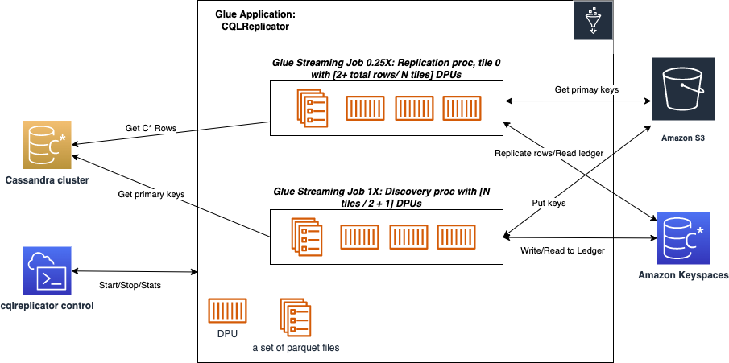

# CQLReplicator with AWS Glue
The objective of this project is to support customers in seamlessly migrating from self-managed Cassandra clusters to Amazon Keyspaces.
This migration approach ensures zero downtime, no code compilation, predictable incremental traffic, and reduced migration costs.

## Architecture
This solution offers customers the flexibility to scale the migration workload up and out by deploying multiple Glue jobs of CQLReplicator. 
Each glue job (tile) is tasked with handling a specific subset of primary keys (250K per tile) to distribute migration workload evenly across Glue data processing units. 
A single replication glue job (DPU - 0.25X) can push up to 2800 WCUs per second against the target table in Amazon Keyspaces.
This allows for easy estimation of the final traffic against Amazon Keyspaces.



## Prerequisites
List of prerequisites needed to run CQLReplicator with AWS Glue, such as:

- AWS account
- [AWS CloudShell](https://aws.amazon.com/cloudshell/)
- [AWS Glue](https://aws.amazon.com/glue/)
- [Amazon Keyspaces](https://aws.amazon.com/keyspaces/) (keyspace and tables)
- [Cassandra cluster](https://docs.aws.amazon.com/prescriptive-guidance/latest/patterns/deploy-a-cassandra-cluster-on-amazon-ec2-with-private-static-ips-to-avoid-rebalancing.html)
- [Reference](https://docs.datastax.com/en/developer/java-driver/4.3/manual/core/configuration/reference/) configuration 
files for Amazon Keyspaces and Cassandra Cluster

## Init migration process
The following command initializes the CQLReplicator environment, which involves the copying JAR artifacts, creation a Glue connector, 
a S3 bucket, a Glue job, migration keyspace, and ledger table. 

To enable AWS Glue components to communicate, you must set up access to your Cassandra cluster in Amazon VPC. 
To enable AWS Glue to communicate between its components, specify a security group with a self-referencing inbound rule 
for all TCP ports. By creating a self-referencing rule, you can restrict the source to the same security group in the VPC, 
and it's not open to all networks. The default security group for your VPC might already have a self-referencing inbound rule 
for ALL Traffic.

`--sg` - these're security groups(s) which allow access to the Cassandra cluster from AWS Glue and includes the self-referencing
inbound rule for all traffic.
`--subnet` - this is the subnet to which the Cassandra cluster belongs.
`--az` - this is the AZ of the subnet
`--region` - AWS region where the Cassandra cluster is deployed 
`glue-iam-role` - you need [the IAM role permissions](https://docs.aws.amazon.com/glue/latest/dg/create-an-iam-role.html)
that AWS Glue can assume when calling other services on your behalf. Services: Amazon Keyspaces and S3
`--landing zone` - this is an optional parameter because can reuse any existing S3 buckets. 
If you don't supply it, init process will try to create a new bucket to store config, JAR artifacts, and intermediate files.

Reference configuration files `CassandraConnector.conf` and `KeyspacesConnector.conf` should be copied to ../conf.

```shell
    cqlreplicator --state init --sg '"sg-1","sg-2"' \ 
                  --subnet "subnet-XXXXXXXXXXXX" --az us-west-2a --region us-west-2 \ 
                  --glue-iam-role glue-cassandra-migration --landing-zone s3://cql-replicator-1234567890-us-west-2
```
After running this command, you should find in the AWS account:
1. CQLReplicator Glue job and Glue connector in AWS Glue
2. Amazon S3 bucket that stores the artifacts
3. Keyspace `migration` and `ledger` table in Amazon Keyspaces

## Start migration process
To operate CQLReplicator on AWS Glue, you need to use `--state run` command, followed by a series of parameters. The precies
configuration of these is primarily determined by your unique migration requirements. For instance, these settings may vary 
if you choose to replicate TTLs, updates, or offloading objects exceeding 1MB to Amazon S3.

### Getting Started
Let's run the following command to replicate the workload from the Cassandra cluster to Amazon Keyspaces.
Your source keyspace and table `ks_test_cql_replicator.test_cql_replicator` in the Cassandra cluster.
Your target keyspace and table `ks_test_cql_replicator.test_cql_replicator` in Amazon Keyspaces.
Parameter `--inc-traffic` - enables incremental traffic to not overload the Cassandra Cluster and Amazon Keyspaces
with high number of requests. CQLReplicator is going to increase traffic every 2 minutes. In the following
example with 8 tiles, one avg. Cassandra row is under 1KB, the traffic is going to be increased by 12.5% 
every 2 minutes. At peak traffic, it can reach up to 22,400 WCUs per second.


```shell
   cqlreplicator --state run --tiles 8 --landing-zone s3://cql-replicator-1234567890-us-west-2 \
                 --src-keyspace ks_test_cql_replicator --src-table test_cql_replicator \ 
                 --trg-keyspace ks_test_cql_replicator --trg-table test_cql_replicator --inc-traffic
```

### Replicate near-real time updates and inserts
```shell
   cqlreplicator --state run --tiles 8 --landing-zone s3://cql-replicator-1234567890-us-west-2 --writetime-column col3  \
                 --src-keyspace ks_test_cql_replicator --src-table test_cql_replicator \ 
                 --trg-keyspace ks_test_cql_replicator --trg-table test_cql_replicator --inc-traffic
```

### Replicate with TTL
the TTL feature should be [enabled](https://docs.aws.amazon.com/keyspaces/latest/devguide/TTL-how-it-works.html#ttl-howitworks_enabling) 
on the target table before running the following command
```shell
   cqlreplicator --state run --tiles 8 --landing-zone s3://cql-replicator-1234567890-us-west-2 --writetime-column col3  \
                 --src-keyspace ks_test_cql_replicator --src-table test_cql_replicator --ttl-column col3 \ 
                 --trg-keyspace ks_test_cql_replicator --trg-table test_cql_replicator --inc-traffic
```

### Offload large objects
Before running the migration process configure [lifecycle](https://docs.aws.amazon.com/AmazonS3/latest/userguide/intro-lifecycle-rules.html)
for the S3 bucket to delete objects after expiration.
```shell
./cqlreplicator --state run --tiles 8 --landing-zone s3://cql-replicator-1234567890-us-west-2 --src-keyspace ks_test_cql_replicator 
                --src-table test_cql_replicator --trg-keyspace ks_test_cql_replicator --trg-table test_cql_replicator \ 
                --ttl-column col3 --offload-large-objects '{"column":"col1","bucket":"my-application-resource",
                                          "prefix":"ks_test_cql_replicator/test_cql_replicator/col1","xref":"link"}'
```

## Stop migration process
To stop migration process gracefully run the following command:
```shell
   cqlreplicator --state request-stop --landing-zone s3://cql-replicator-1234567890-us-west-2 \ 
                 --src-keyspace ks_test_cql_replicator --src-table test_cql_replicator
```

## Recover from failures
Customers can simply restart the migration process from the point where it was interrupted by restarting failed jobs.
In order, to restart failed CQLReplicator jobs, you need to re-run `--state run` with the same parameters.

## Get migration stats
To get replicated row stats, run the following command:
```shell
   cqlreplicator --state stats --landing-zone s3://cql-replicator-1234567890-us-west-2 \ 
                 --src-keyspace ks_test_cql_replicator --src-table test_cql_replicator
```

## Clean up
The following command will delete the Glue job, connector, the S3 bucket, and Keyspaces'table ledger:

```shell
   cqlreplicator --state cleanup --landing-zone s3://cql-replicator-1234567890-us-west-2
```
