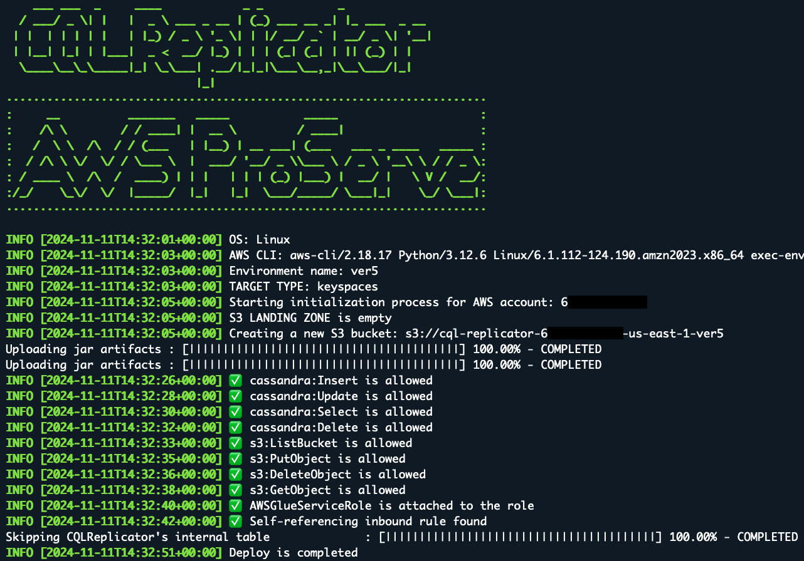
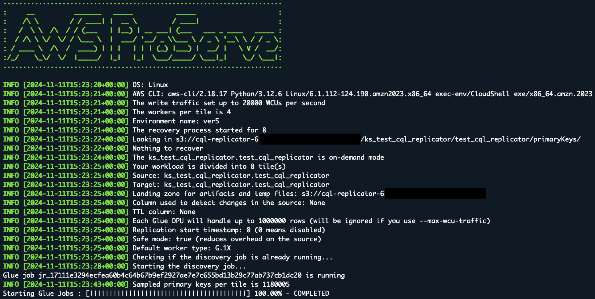
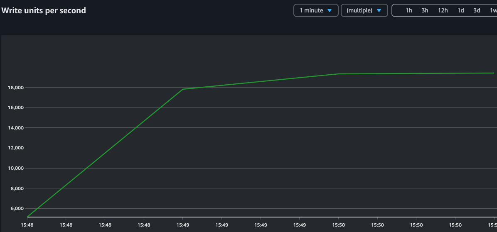
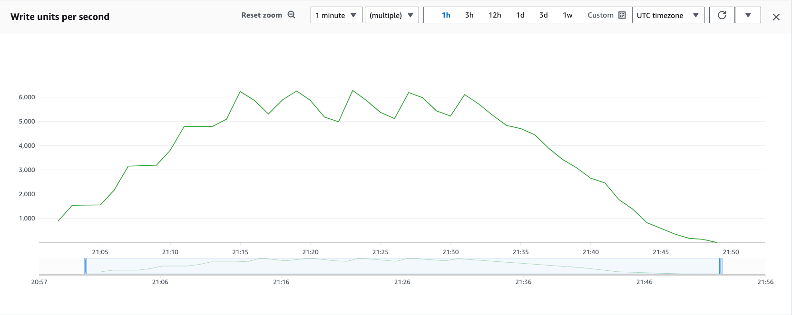

# Replicate workload to Amazon Keyspaces

## Prepare the configuration files
In order to connect to Amazon Keyspaces and the Cassandra cluster you need configure reference 
configuration files `../glue/conf/CassandraConnector.conf` and `../glue/conf/KeyspacesConnector.conf` 
in ../conf accordingly to the environment.

## Init migration process
The following command initializes the CQLReplicator environment, which involves the copying JAR artifacts, creation a Glue connector,
a S3 bucket, a Glue job, migration keyspace, and ledger table.

```shell
    cd cql-replicator/glue/bin &&
    cqlreplicator --cmd init --sg '"sg-1","sg-2"' \ 
                  --subnet "subnet-XXXXXXXXXXXX" --az us-east-1a --region us-east-1 \
                  --env ver5 \  # Optional 
                  --glue-iam-role glue-cassandra-migration \
                  --landing-zone s3://your-s3-bucket \
                  --target-type keyspaces
```
After running the below command, you should find in the AWS account:

1. CQLReplicator-ver5 glue job and Glue connector in AWS Glue console
2. Amazon S3 bucket that stores the artifacts
3. Keyspace `migration` and `ledger` table in Amazon Keyspaces



Note: If you run the CQLReplicator on EC2 you should attach the following inline policy:
```json
{
  "Version": "2012-10-17",
  "Statement": [
    {
      "Effect": "Allow",
      "Action": [
        "iam:GetContextKeysForPrincipalPolicy",
        "iam:SimulatePrincipalPolicy",
        "iam:ListAttachedRolePolicies",
        "iam:PassRole",
        "glue:*",
        "pricing:GetProducts",
        "pricing:DescribeServices",
        "pricing:GetAttributeValues"
      ],
      "Resource": "*"
    }
  ]
}
```

- `--sg` - these security group(s) which allow access to the Cassandra cluster from AWS Glue and includes the
  self-referencing inbound rule for all traffic
- `--subnet` - this is the subnet to which the Cassandra cluster belongs. In AWS Glue, when a Glue job needs to run in
  your Virtual Private Cloud (VPC),
  AWS Glue sets up elastic network interfaces that enable your Glue jobs to connect securely to other resource within
  your VPC. Each elastic network interface
  is assigned a private IP address from the IP address range within the subnet you specified. For example, 20 workers
  need 20 IP addresses.
- `--az` - this is the AZ of the subnet
- `--region` - AWS region where the Cassandra cluster is deployed
- `--glue-iam-role` - you
  need [the IAM role permissions](https://docs.aws.amazon.com/glue/latest/dg/create-an-iam-role.html)
  that AWS Glue can assume when calling other services on your behalf. Services: Amazon Keyspaces and S3
- `--landing-zone` - this is an optional parameter, you can reuse any existing S3 buckets in the AWS account
  If you don't supply it, init process will try to create a new bucket to store config, JAR artifacts, and intermediate
  files
- `--target-type` - this is an optional parameter, the default value is `keyspaces`, available options: `parquet`
  , `memorydb`,and `opensearch`
- `--skip-glue-connector` - this is an optional parameter allows you to skip the glue connector creation step
- `--skip-keyspaces-ledger` - in case if you don't want to create/delete the ledger (the internal table in Amazon
  Keyspaces migration.ledger)
- `--main-script-landing` - use this flag if you want to store the main script in the `s3://your-landing-zone/script/CQLReplicator.scala`
- `--env` - use to create multiple environments, e.g. dev/test/prod

## Start migration process
To operate CQLReplicator on AWS Glue, you need to use `--cmd run` command, followed by a series of parameters. The
precise configuration of these is primarily determined by your unique migration requirements. For instance, these
settings may vary if you choose to replicate TTLs, updates, or offloading objects exceeding 1MB to Amazon S3.

The CQLReplicator offers three options for operation:
1. For high-volume traffic exceeding 5000 Write Capacity Units (WCU) per second:
    * Use the command: `--max-wcu-traffic 20000`
    *  This setting uses the default of 4 tiles (Glue jobs)
2. For lower-volume traffic below 5000 WCU per second:
    * Use the command:` --max-wcu-traffic 4000 --tiles 1`
    * This setting customizes the number of tiles to 1
3. For custom configurations:
    * Use the command: --tiles 12 (without specifying --max-wcu-traffic)
    * This allows you to set a custom number of tiles with your preferred worker type
    * Note: Changing the number of tiles requires to resize the migration process
4. When estimating tile requirements:
    * Each tile (concurrent Glue job) can process up to 74 million primary keys
    * This is achieved using 299 DPUs (G.025X) maximum
    * For example, 12 tiles can handle up to 1 billion primary keys

These guidelines help optimize the CQLReplicator's performance based on your specific traffic and data volume needs.

### Replicate near-real time updates, inserts, and deletes
Let's run the following command to replicate the workload from the Cassandra cluster to Amazon Keyspaces with the write traffic 20000 WCUs per second:

Note: The following command is going to capture only "insert" or "delete". In order, to capture "update" you need to add an arbitrary column from you table
that is constantly updated, for example, add `--writetime-column your-column` to the following command line.

```shell
   cqlreplicator --cmd run --max-wcu-traffic 20000 --landing-zone s3://your-s3-bucket-ver5 --region us-east-1 \
                 --src-keyspace ks_test_cql_replicator --src-table test_cql_replicator \ 
                 --trg-keyspace ks_test_cql_replicator --trg-table test_cql_replicator \
                 --env ver5 --target-type keyspaces
```


The write traffic against the Amazon Keyspaces table should not exceed 20000 WCUs per second



Your source keyspace and table `ks_test_cql_replicator.test_cql_replicator` in the Cassandra cluster.
Your target keyspace and table `ks_test_cql_replicator.test_cql_replicator` in Amazon Keyspaces.
Parameter `--inc-traffic` - enables incremental traffic to not overload the Cassandra Cluster and Amazon Keyspaces
with high number of requests. CQLReplicator is going to increase traffic every 4 minutes. In the following
example with 4 tiles and one cassandra row is under 2KB, the traffic is going to be gradually increased every 4
minutes. At peak traffic, it can reach up to 6,300 WCUs per second.

```shell
   cqlreplicator --cmd run --max-wcu-traffic 6000 --landing-zone s3://your-s3-bucket-ver5 --region us-east-1 \
                 --writetime-column col3 --src-keyspace ks_test_cql_replicator --src-table test_cql_replicator \ 
                 --trg-keyspace ks_test_cql_replicator --trg-table test_cql_replicator \
                 --env ver5 --inc-traffic --target-type keyspaces
```


### Switch from UNLOGGED BATCH to Single Insert
By default, CQLReplicator uses UNLOGGED BATCH operations for improved performance and cost efficiency.
However, when dealing with large partitions, you may want to disable batching and use single inserts instead to avoid throttling issues in Amazon Keyspaces.
This can help ensure smoother migration of large partitions.

```shell
   cqlreplicator --cmd run --max-wcu-traffic 6000 --landing-zone s3://your-s3-bucket-ver5 --region us-east-1 \
                 --writetime-column col3 --src-keyspace ks_test_cql_replicator --src-table test_cql_replicator \ 
                 --trg-keyspace ks_test_cql_replicator --trg-table test_cql_replicator \
                 --env ver5 --inc-traffic --target-type keyspaces --json-mapping '{"keyspaces": {"writeConfiguration": { "maxStatementsPerBatch": 1}}}’
```

### Change the workload type
If you want to replicate only the historical workload and release Glue resources once it's completed, add the following flag
`--workload-type batch` to the command line, for example:

```shell
   cqlreplicator --cmd run --max-wcu-traffic 20000 --landing-zone s3://your-s3-bucket-ver5 --region us-east-1 \
                 --writetime-column col3 --src-keyspace ks_test_cql_replicator --src-table test_cql_replicator \ 
                 --trg-keyspace ks_test_cql_replicator --trg-table test_cql_replicator \
                 --env ver5 --inc-traffic --target-type keyspaces --env ver5 --workload-type batch
```

### Replicate with TTL
the TTL feature should be [enabled](https://docs.aws.amazon.com/keyspaces/latest/devguide/TTL-how-it-works.html#ttl-howitworks_enabling)
on the target table before running the following command
```shell
   cqlreplicator --cmd run --max-wcu-traffic 20000 --landing-zone s3://your-s3-bucket-ver5 --region us-east-1 \
                 --writetime-column col3 --src-keyspace ks_test_cql_replicator --src-table test_cql_replicator --ttl-column col3 \ 
                 --trg-keyspace ks_test_cql_replicator --trg-table test_cql_replicator --inc-traffic --env ver5 --target-type keyspaces
```

### Replicate with original timestamp
the Client-Side Timestamps feature should be [enabled](https://docs.aws.amazon.com/keyspaces/latest/devguide/client-side-timestamps.html)
on the target table before running the following command
```shell
   cqlreplicator --cmd run --max-wcu-traffic 20000 --landing-zone s3://your-s3-bucket-ver5 --region us-east-1 \
                 --writetime-column col3 --src-keyspace ks_test_cql_replicator --src-table test_cql_replicator --env ver5 \ 
                 --trg-keyspace ks_test_cql_replicator --trg-table test_cql_replicator  \
                 --target-type keyspaces --json-mapping '
                    {
                     "replication": {
                       "replicateWithTimestamp": true
                     }
                    }'
```

### Offload large objects
Before running the migration process
configure [lifecycle](https://docs.aws.amazon.com/AmazonS3/latest/userguide/intro-lifecycle-rules.html)
for the S3 bucket to delete objects after expiration. The xref column should be present in the source and the target
tables before running the cqlreplicator.

The payload will be compressed by [LZ4](https://fuchsia.googlesource.com/third_party/lz4/+/refs/tags/v1.7.5/README.md) and stored in the S3 bucket. The compressed payload includes the length of the original
decompressed data, so that you don't need to save the length at anywhere else. The compressed data must be decompressed by
LZ4DecompressorWithLength and is NOT compatible with any other decompressors in lz4-java or any other lz4 tools.
This class deliberately does not extend LZ4Compressor because they are not interchangeable.

```shell
./cqlreplicator --cmd run --max-wcu-traffic 20000 --landing-zone s3://your-s3-bucket-ver5 --src-keyspace ks_test_cql_replicator \
                --src-table test_cql_replicator --trg-keyspace ks_test_cql_replicator --trg-table test_cql_replicator --env ver5 \
                --region us-east-1 --ttl-column col3 --target-type keyspaces --json-mapping '
                {
                 "replication": {
                   "allColumns": true,
                   "columns":[""],
                   "useCustomSerializer": false,
                   "useMaterializedView": {
                     "enabled": false,
                     "mvName": "mvName"
                  }
                },
                 "keyspaces": {
                   "compressionConfig": {
                   "enabled": false,
                   "compressAllNonPrimaryColumns": false,
                   "compressNonPrimaryColumns": [""],
                   "targetNameColumn": ""
                 },
                 "largeObjectsConfig": {
                   "enabled": true,
                   "column": "col1",
                   "bucket": "my-application-resource",
                   "prefix": "ks_test_cql_replicator/test_cql_replicator/col1",
                   "enableRefByTimeUUID": false,
                   "xref": "link"
                 }
                }}'
```
If you enable `enableRefByTimeUUID` the S3 bucket will be populated in the following format s3://my-application-resource/ks_test_cql_replicator/test_cql_replicator/col1/<timeUUID>.
The target column link will be populated by a referencing timeUUID, and col1 will be skipped.

If you disable `enableRefByTimeUUID` the S3 bucket will be populated in the following format s3://my-application-resource/ks_test_cql_replicator/test_cql_replicator/col1/key=<col0>:<key>/payload,
where col0 is the clustering column, and key is the partition key. The target column link and col1 will be skipped.

### Handling Failed Rows
When the CQLReplicator encounters persistent failures during replication, failed rows are automatically stored in
a Dead Letter Queue (DLQ) directory within your S3 bucket.
Failed rows are stored in the following S3 path format: s3://your-s3-bucket-ver5/ks-name/tbl-name/dlq.

Common failure scenarios:
- When source partitions exceed tens of megabytes
- When operations exceed the maximum retry limit (64 attempts). Usually indicates persistent connectivity or resource issues
- When the target table schema doesn't match the source. Fix the schema before replaying

Best practises:
- Review the failed rows in DLQ to understand the failure patterns
- Address any underlying issues (schema, connectivity, resources) before replay
- Monitor the replay process to ensure successful completion

To replay failed rows:
1. Stop the CQLReplicator with `request-stop`
2. Run it again with `--replay-log` - this option allows you to replay failed operations during the replication phase.

## Stop migration process
To stop migration process gracefully run the following command for all tiles:

```shell
   cqlreplicator --cmd request-stop --landing-zone s3://your-s3-bucket-ver5 --region us-east-1-ver5 \
                 --src-keyspace ks_test_cql_replicator --src-table test_cql_replicator--target-type keyspaces --env ver5
```

To stop migration process gracefully run the following command for a single tile:

```shell
   cqlreplicator --cmd request-single-stop --tile 1 --landing-zone s3://your-s3-bucket-ver5 --region us-east-1 \
                 --src-keyspace ks_test_cql_replicator --src-table test_cql_replicator --target-type keyspaces --env ver5
```

To start migration process for a single tile:

```shell
   cqlreplicator --cmd run-single --tile 1 --tiles 4 --landing-zone s3://your-s3-bucket-ver5 --region us-east-1 \
                 --src-keyspace ks_test_cql_replicator --src-table test_cql_replicator \ 
                 --trg-keyspace ks_test_cql_replicator --trg-table test_cql_replicator --inc-traffic --target-type keyspaces --env ver5
```

To force an immediate termination of the CQLReplicator:
```shell
   cqlreplicator --cmd kill --landing-zone s3://your-s3-bucket-ver5 --region us-east-1 \
                 --src-keyspace ks_test_cql_replicator --src-table test_cql_replicator --target-type keyspaces --env ver5
```

## Recover from failures
Customers can simply restart the migration process from the point where it was interrupted by restarting the failed
CQLReplicators jobs. To restart the failed CQLReplicators jobs, you need to rerun your `run` command with the same
parameters
if both the discovery and some of the replicators have failed. If the discovery job is still running and some of the
replicators have failed, you need to use extra flag `--skip-discovery`.

## Cleanup the ledger
If you wish to reset the CQLReplicator for a specific table, add the `--cleanup-requested` or `--cr` flag to your `run` command.
This action will clean up both the internal CQLReplicator ledger table and the S3 data, but don't forget to remove it
if you want to stop it and run it again.

## Get migration stats
To obtain the number of replicated rows during the back filling phase, run the following command:

```shell
   cqlreplicator --cmd stats --landing-zone s3://your-s3-bucket-ver5 \ 
                 --src-keyspace ks_test_cql_replicator --src-table test_cql_replicator \
                 --target-type keyspaces --region us-east-1 --env ver5
```

To obtain the number of replicated rows after the back filling phase, run the following command:

```shell
cqlreplicator --cmd stats --landing-zone s3://your-s3-bucket-ver5 \
              --src-keyspace ks_test_cql_replicator --src-table test_cql_replicator \
              --target-type keyspaces --region us-east-1 --replication-stats-enabled --env ver5
```

```
    ___ ___  _     ____            _ _           _
  / ___/ _ \| |   |  _ \ ___ _ __ | (_) ___ __ _| |_ ___  _ __
 | |  | | | | |   | |_) / _ \ '_ \| | |/ __/ _` | __/ _ \| '__|
 | |__| |_| | |___|  _ <  __/ |_) | | | (_| (_| | || (_) | |
  \____\__\_\_____|_| \_\___| .__/|_|_|\___\__,_|\__\___/|_|
                            |_|
·······································································
:     __          _______   _____           _____                     :
:    /\ \        / / ____| |  __ \         / ____|                    :
:   /  \ \  /\  / / (___   | |__) | __ ___| (___   ___ _ ____   _____ :
:  / /\ \ \/  \/ / \___ \  |  ___/ '__/ _ \\___ \ / _ \ '__\ \ / / _ \:
: / ____ \  /\  /  ____) | | |   | | | (_) |___) |  __/ |   \ V /  __/:
:/_/    \_\/  \/  |_____/  |_|   |_|  \___/_____/ \___|_|    \_/ \___|:
·······································································
[2024-02-02T16:50:18-05:00] OS: Linux
+------------------------------------------------------------------------+
| Tile     | Inserts  | Updates  | Deletes  | Timestamp                  |
+------------------------------------------------------------------------+
| 0        | 4        | 1        | 0        | "2024-02-02T21:50:12.888"  |
+------------------------------------------------------------------------+
| 1        | 2        | 2        | 1        | "2024-02-02T21:50:25.454"  |
+------------------------------------------------------------------------+
[2024-02-02T16:50:39-05:00] Discovered rows in ks_test_cql_replicator.test_cql_replicator is 70,270
[2024-02-02T16:50:39-05:00] Replicated rows in ks_test_cql_replicator.test_cql_replicator is 70,270
```
## Monitor incoming traffic with Amazon CloudWatch
You can monitor CQLReplicator incoming traffic from the source Cassandra cluster. It automatically creates a CloudWatch
dashboard for each source table,for example,`CQLReplicator-ks_test_cql_replicator-test_cql_replicator`.

To enable CQLReplicator telemetry in Amazon CloudWatch follow these steps:
1. Add the IAM policy `CloudWatchFullAccessV2` to your Glue Role.
2. Modify the `CassandraConnector.conf` file and upload it back to the artifacts folder in the landing S3 bucket with the
   following settings:
   `advanced.metrics.factory.class = MicrometerMetricsFactory`
   `advanced.metrics.session.enabled = [cql-requests,cql-client-timeouts]`
3. You might need to restart the CQLReplicator by running`request-stop`, then start it again.

## AWS Glue Monitoring
You can profile and monitor CQLReplicator operations using AWS Glue job profiler. It collects and processes raw data
from AWS Glue jobs into readable, near real-time metrics stored in Amazon CloudWatch.
These statistics are retained and aggregated in CloudWatch so that you can access historical information for a better
perspective on how your application is performing.

In order tp enable the CQLReplicator enhanced monitoring use the `--enhanced-monitoring-enabled` flag with your init
command.

***You may incur additional charges when you enable job metrics and CloudWatch custom metrics are created***

## Point in time replication
if you want to replicate your data from a timestamp simply add the flag `--start-replication-from` followed by
the timestamp to your command line:

```shell
   cqlreplicator --cmd --max-wcu-traffic 20000 --landing-zone s3://your-s3-bucket-ver5  \
                 --writetime-column col1 --region us-east-1 \
                 --src-keyspace ks_test_cql_replicator --src-table test_cql_replicator \
                 --trg-keyspace ks_test_cql_replicator --trg-table test_cql_replicator \
                 --target-type keyspaces --start-replication-from 1706408365278858 --env ver5
```

if you want to change the default point in time replication behavior and replicate data *before* timestamp then specify predicate in json mapping:
```json
{
  "replication": {
    "pointInTimeReplicationConfig": {
      "predicateOp": "lessThanOrEqual"
    }
  }
}
```

## Compress selected columns
To minimize the size of large columns in the target table, enable the `compressionConfig` in the json mapping.
All selected columns will be encoded in JSON format and compressed by the LZ4 fast compressor.

Note that the compressed payload includes the length of the original decompressed data, so that you don't need to save
the length at anywhere else. The compressed data must be decompressed by [LZ4DecompressorWithLength](https://javadoc.io/doc/org.lz4/lz4-java/latest/net/jpountz/lz4/LZ4DecompressorWithLength.html)
and is NOT compatible with any other decompressors in lz4-java or any other lz4 tools. This class deliberately does not extend
LZ4Compressor because they are not interchangeable.

```shell
./cqlreplicator --cmd run --max-wcu-traffic 20000 --landing-zone "s3://your-s3-bucket-ver5" --writetime-column col2 \
                                      --region us-east-1 --src-keyspace ks_test_cql_replicator --src-table test_cql_replicator \ 
                                      --trg-keyspace ks_test_cql_replicator --trg-table test_cql_replicator_compressed_columns --env ver5 \
                                      --target-type keyspaces --json-mapping '{
                                          "replication": {
                                            "allColumns": true,
                                            "columns":[],
                                            "useCustomSerializer": false
                                          },
                                          "keyspaces": {
                                          "compressionConfig": {
                                            "enabled": true,
                                            "compressAllNonPrimaryColumns": false,
                                            "compressNonPrimaryColumns": ["col2","col3","col4","col5","col6","col7","col8"],
                                            "targetNameColumn": "compressedPayload"
                                          }}
                                        }'
```

## Replicate only selected columns
if you want to change the replicated columns set `allColumns`:`false`, and set the columns
list `columns`:`["col1","col2"]`
in the json mapping during the `run`, for example,

```shell
./cqlreplicator --cmd run --max-wcu-traffic 20000 --landing-zone "s3://your-s3-bucket-ver5" --writetime-column col2 \
                                      --region us-east-1 --src-keyspace ks_test_cql_replicator --src-table test_cql_replicator \ 
                                      --trg-keyspace ks_test_cql_replicator --trg-table test_cql_replicator_compressed_columns --env ver5 \
                                      --target-type keyspaces --json-mapping '{
                                          "replication": {
                                            "allColumns": false,
                                            "columns":["col1", "col2"],
                                            "useCustomSerializer": false
                                          },
                                          "keyspaces": {
                                          "compressionConfig": {
                                            "enabled": false,
                                            "compressAllNonPrimaryColumns": false,
                                            "compressNonPrimaryColumns": ["col2","col3","col4","col5","col6","col7","col8"],
                                            "targetNameColumn": "compressedPayload"
                                          }}
                                        }'
```

```shell
./cqlreplicator --cmd run --max-wcu-traffic 20000 --landing-zone "s3://your-s3-bucket-ver5" --writetime-column col2 \
                                      --region us-east-1 --src-keyspace ks_test_cql_replicator --src-table test_cql_replicator \ 
                                      --trg-keyspace ks_test_cql_replicator --trg-table test_cql_replicator_filtered_columns --env ver5 \
                                      --target-type keyspaces --json-mapping '{
                                          "replication": {
                                            "allColumns": false,
                                            "columns":["key","col0","col1","col2","col3","col4","col5","col6"],
                                            "useCustomSerializer": false
                                          },
                                          "keyspaces": {
                                          "compressionConfig": {
                                            "enabled": false,
                                            "compressAllNonPrimaryColumns": false,
                                            "compressNonPrimaryColumns": ["payload"],
                                            "targetNameColumn": "compressed"
                                          }}
                                        }'
```
## Filtering Records by Primary and Non-Primary Keys
There are use-cases when you need to filter out some certain keys during the migration phase, for example:

```shell
./cqlreplicator --cmd run --max-wcu-traffic 20000 --landing-zone "s3://your-s3-bucket-ver5" --writetime-column col2 \
                                      --region us-east-1 --src-keyspace ks_test_cql_replicator --src-table test_cql_replicator \ 
                                      --trg-keyspace ks_test_cql_replicator --trg-table test_cql_replicator_filtered_columns --env ver5 \
                                      --target-type keyspaces --json-mapping '{
                                          "keyspaces": {
                                            "transformation": {        
                                            "enabled": true,        
                                            "filterExpression": "client_id NOT like \"ACME%\"" 
                                            }
                                          }
                                        }'
```

```shell
./cqlreplicator --cmd run --max-wcu-traffic 20000 --landing-zone "s3://your-s3-bucket-ver5" --writetime-column col2 \
                                      --region us-east-1 --src-keyspace ks_test_cql_replicator --src-table test_cql_replicator \ 
                                      --trg-keyspace ks_test_cql_replicator --trg-table test_cql_replicator_filtered_columns --env ver5 \
                                      --target-type keyspaces --json-mapping '{
                                          "keyspaces": {
                                            "transformation": {        
                                            "enabled": true,
                                            "addNonPrimaryKeyColumns": ["col2"],        
                                            "filterExpression": "col2 > timestamp \"2024-11-12 00:00:59.588000+0000\"" 
                                            }
                                          }
                                        }'
```
Note: You can use only primary key columns in the `filterExpression` and it should be defined as [the Spark SQL Expression](https://spark.apache.org/docs/3.3.0/api/sql/index.html).

## Not overwriting existing records in Amazon Keyspaces
In order to preserve existing records during the bulk migration phase set `readBeforeWrite` to `true` in the `json-mapping`, for example:
```shell
./cqlreplicator --cmd run --max-wcu-traffic 20000 --landing-zone "s3://your-s3-bucket-ver5" --writetime-column col2 \
                                      --region us-east-1 --src-keyspace ks_test_cql_replicator --src-table test_cql_replicator \ 
                                      --trg-keyspace ks_test_cql_replicator --trg-table test_cql_replicator_filtered_columns --env ver5 \
                                      --target-type keyspaces --json-mapping '{
                                          "keyspaces": {
                                              readBeforeWrite: true
                                          }
                                        }'
```
## Converting UDTs to JSON
This feature allows the CQLReplicator tool to automatically convert UDTs in C* to plain JSON strings.
This enhancement provides a seamless way to transform UDTs into a more universal compatible JSON format,
facilitating easier integration with other NoSQL databases.

```shell
./cqlreplicator --cmd run --max-wcu-traffic 20000 --landing-zone "s3://your-s3-bucket-ver5" --writetime-column col2 \
                                      --region us-east-1 --src-keyspace ks_test_cql_replicator --src-table test_cql_replicator \ 
                                      --trg-keyspace ks_test_cql_replicator --trg-table test_cql_replicator_filtered_columns --env ver5 \
                                      --target-type keyspaces --json-mapping '{
                                          "keyspaces": {
                                            "udtConversion": { "enabled": true,"columns": ["device", "user"] }
                                            }}'
```

## Enable the custom JSON Serializer
The CQLReplicator relies on Cassandra JSON encoding/decoding that has been introduced in Cassandra 2.2, but if you use
older Cassandra version you must enable the custom JSON Serialization on the client side:

```shell
./cqlreplicator --cmd run --max-wcu-traffic 20000 --landing-zone "s3://your-s3-bucket-ver5" --writetime-column col2 \
                                      --region us-east-1 --src-keyspace ks_test_cql_replicator --src-table test_cql_replicator \ 
                                      --trg-keyspace ks_test_cql_replicator --trg-table test_cql_replicator_filtered_columns --env ver5 \
                                      --target-type keyspaces --json-mapping '{
                                          "replication": {
                                            "allColumns": false,
                                            "columns":["key","col0","col1","col2","col3","col4","col5","col6"],
                                            "useCustomSerializer": true
                                          },
                                          "keyspaces": {
                                          "compressionConfig": {
                                            "enabled": false,
                                            "compressAllNonPrimaryColumns": false,
                                            "compressNonPrimaryColumns": ["payload"],
                                            "targetNameColumn": "compressed"
                                          }}
                                        }'
```
### Limitations
The custom JSON serializer supports the following data types: boolean, int, text, ascii, bigint, blob, counter, date,
decimal, double,float,timestamp,smallint,timeuuid,uuid, and tinyint.

The following parameters must be
set `allColumns`:`false`, `columns` : ["partitionKey", "clusteringKey","regularColumn"],
and `useCustomSerializer`:`true`.

## Cost optimization

### Use Batch Mode for historical workload
In order to reduce AWS Glue costs after the historical workload moved to the target storage:

1. Stop the migration process:
    ```shell
    cqlreplicator --cmd request-stop --landing-zone s3://your-s3-bucket-ver5 --region us-east-1 \
                  --target-type keyspaces --src-keyspace ks_test_cql_replicator --src-table test_cql_replicator --env ver5
    ```
2. Restart the migration process with the same number of tiles but with lower number of
   DPUs:
   ```shell
   cqlreplicator --cmd run --max-wcu-traffic 5000 --landing-zone s3://your-s3-bucket-ver5 --region us-east-1 \
                 --src-keyspace ks_test_cql_replicator --src-table test_cql_replicator \
                 --trg-keyspace ks_test_cql_replicator --trg-table test_cql_replicator --target-type keyspaces --env ver5
   ```

### Use scheduled run
1. Stop the migration process:
    ```shell
    cqlreplicator --cmd request-stop --landing-zone s3://your-s3-bucket-ver5 --region us-east-1 \
                  --src-keyspace ks_test_cql_replicator --src-table test_cql_replicator --target-type keyspaces --env ver5
    ```
2. Schedule the migration process to run it every 30 minutes:

   ```shell
   ./cqlreplicator --cmd scheduled-run --max-wcu-traffic 5000 --landing-zone s3://your-s3-bucket-ver5 --region us-east-1 \
                   --src-keyspace ks_test_cql_replicator --src-table test_cql_replicator \
                   --trg-keyspace ks_test_cql_replicator --trg-table test_cql_replicator \
                   --env ver5 --target-type keyspaces --schedule "*/30 * * * *"
   ```
   Note: Use only EC2 or ECS to run scheduled jobs

### Monitor your Migration costs
- Monitor costs by reviewing the automated estimation displayed when CQLReplicator initializes, which provides output such as:
  `The total cost of running CQLReplicator is XX.YY USD per hour`
- Use Cost Dashboard and AWS Cost Explorer to calculate and track cost savings from optimization efforts

## Resize the replication process
To modify the number of tiles (Glue jobs) during the replication process:
- Safely stop the current migration process: Do not force-stop any running jobs to prevent data inconsistency,
- Ensure system state: Verify all Glue jobs show "COMPLETED" status and Check that no replication processes are actively running
- After confirmation of complete shutdown, proceed with your desired tile count modifications using the appropriate commands:

  a. Reduce the number of tiles:
    ```shell 
      ./cqlreplicator --cmd resize --tiles 4 --landing-zone s3://your-s3-bucket-ver5 --region us-east-1 \ 
                      --src-keyspace ks_test_cql_replicator --src-table test_cql_replicator --target-type keyspaces --env ver5
    ```
  Increase the number of tiles:
    ```shell 
      ./cqlreplicator --cmd resize --tiles 12 --landing-zone s3://your-s3-bucket-ver5 --region us-east-1 \
                      --src-keyspace ks_test_cql_replicator --src-table test_cql_replicator --target-type keyspaces --env ver5
    ```
  b. After the resizing job is completed you can start the CQLReplicator again with the new number of tiles `--tiles 12`

After confirming the resizing job has successfully completed, restart CQLReplicator with the updated number of tiles.
Before restarting, verify that all system components are in a stable state.

## Know issues
| Error Message/Issue                                                                                                           | CW Discovery logs | CW Replication logs | Work around                                                                                                                                                                                                     |
|-------------------------------------------------------------------------------------------------------------------------------|-------------------|---------------------|-----------------------------------------------------------------------------------------------------------------------------------------------------------------------------------------------------------------|
| 1. No space left on device                                                                                                    | Yes               | No                  | Scale out the replication process by increasing the number of DPUs per discovery Glue job, for example, add `--odw 15`                                                                                          |
| 2. No space left on device                                                                                                    | Yes               | No                  | Increase the `--max-wcu-traffic`                                                                                                                                                                                |
| 3. You have limited IPs in the subnet                                                                                         | Yes               | Yes                 | Create a new Glue connection with the new subnet and attach the CQLReplicator Glue Job                                                                                                                          |
| 5. Cassandra timeout during read query at consistency ONE <br/>(1 responses were required but only 0 replica responded) <br/> | Yes               | No                  | Reduce page size and increase the request timeout in CassandraConnector.conf                                                                                                                                    |
| 6. Cassandra timeout during read query at consistency ONE <br/>(1 responses were required but only 0 replica responded) <br/> | Yes               | No                  | Create a materialized view in the Cassandra cluster with the same primary keys and one regular column.<br/> Configure the CQLReplicator to use this materialized view as the source for the primary keys. <br/> |
| 7. Cassandra timeout during read query at consistency ONE <br/>(1 responses were required but only 0 replica responded) <br/> | Yes               | No                  | Increase `read_request_timeout_in_ms`, `range_request_timeout_in_ms`, and `request_timeout_in_ms` in the cassandra.yaml and run rolling restart of the Cassandra cluster.                                       |
| 8. java.lang.OutOfMemoryError: GC overhead limit exceeded                                                                     | Yes               | No                  | Increase the number of DPUs for the discovery job by using the parameter, e.g. `--override-discovery-workers 12`                                                                                                |
| 9. Improve update/insert latency after the historical phase                                                                   | No                | No                  | Open the Glue job -> Job Details -> Advanced properties -> Job parameters, and in the Value of the key `--conf` reduce parameters for spark.shuffle.partitions=100 and spark.default.parallelism=100 or less    |

### Work around for `Cassandra timeout during read query at consistency ONE` with Cassandra materialized view
1. Create the materialized view `ks_test_cql_replicator_mv` based on the `ks_test_cql_replicator` in the Cassandra
   cluster with the same primary key and only one regular column
2. Prepare the json mapping with ```"useMaterializedView": {"enabled": true, "mvName": "ks_test_cql_replicator_mv"}```
3. Add the json mapping to the run command, e.g.

```shell 
./cqlreplicator --cmd run --max-wcu-traffic 20000 --landing-zone "s3://your-s3-bucket-ver5" --writetime-column col2 \ 
                                      --ttl-column reg_column --region us-east-1 --src-keyspace ks_test_cql_replicator \ 
                                      --src-table ks_test_cql_replicator --trg-keyspace ks_test_cql_replicator --env ver5 \ 
                                      --trg-table ks_test_cql_replicator --target-type keyspaces --json-mapping '{
                                       "replication": {
                                         "allColumns": true,
                                         "columns":[""],
                                         "useCustomSerializer": false,
                                         "useMaterializedView": 
                                           {
                                             "enabled": true,
                                             "mvName": "ks_test_cql_replicator_mv"
                                           }
                                       },
                                       "keyspaces": {
                                           "compressionConfig": {
                                               "enabled": false,
                                               "compressAllNonPrimaryColumns": false,
                                               "compressNonPrimaryColumns": [""],
                                               "targetNameColumn": ""
                                           }
                                       }}'
```  

## Clean up
The following command will delete the Glue job, connector, the S3 bucket, and the ledger table:

```shell
   cqlreplicator --cmd cleanup --landing-zone s3://your-s3-bucket-ver5 --region "us-east-1"
```

## License
This tool licensed under the Apache-2 License. See the LICENSE file.
